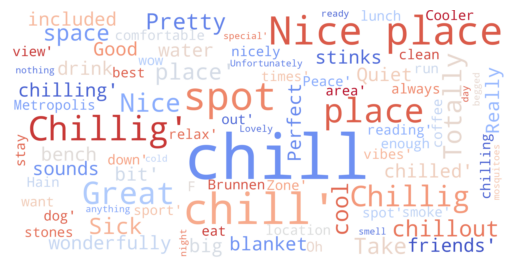

Google Review Topic Modelling
==============================

Testing the BERTopic Model with google review data from urban parks and green areas.

  
  &nbsp;&nbsp;&nbsp;&nbsp;&nbsp;&nbsp;&nbsp;&nbsp;
  

 

**Left**: Google Street View Image  
 
**Right**: Vegetation Segmentation  

