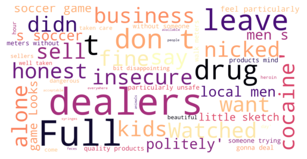
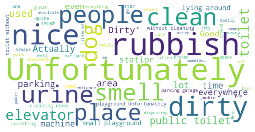

Google Review Topic Modelling
==============================

Testing the BERTopic Model with google review data from urban parks and green areas.
Handing over ca. 20k of google reviews various topics could be modelled.
Such as:

  
  &nbsp;&nbsp;&nbsp;&nbsp;&nbsp;&nbsp;&nbsp;&nbsp;
  

 

  
  &nbsp;&nbsp;&nbsp;&nbsp;&nbsp;&nbsp;&nbsp;&nbsp;
  

